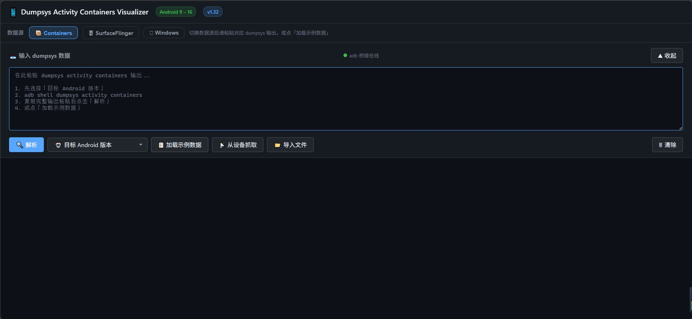

# Dumpsys Activity Containers Visualizer

> 一个**单文件、零依赖**的 Android 窗口层级可视化工具：把 `adb dumpsys` 的庞杂文本，变成可缩放、可搜索、可折叠的层级树与图层卡片。
> 支持 7 条命令，按命令族合并为 **📦 Activity** / **🪟 Window** / **🖥 SurfaceFlinger** / **🗂 Stack List** 四个入口：`dumpsys activity containers`、`dumpsys activity activities`、`dumpsys activity top`、`dumpsys window containers`、`dumpsys window windows`、`dumpsys SurfaceFlinger`、`am stack list`，覆盖 **Android 9 – 16**。

[](LICENSE) [](#快速开始) [](#版本)

---

## 这是什么

在 Android 系统里排查窗口层级、合成合层（HWC）、`mDrawState` 绘制状态时，原生的 `dumpsys` 输出动辄上千行纯文本，人眼几乎无法快速理清「谁在谁上面、谁挡住了谁」。

本工具把这些文本解析成结构化的可视化视图：

- **容器树**：`dumpsys activity containers` 的 WindowContainer 层级（DisplayContent → TaskDisplayArea → Task → ActivityRecord → WindowToken → WindowState …）。
- **HWC 合成预览**：`dumpsys SurfaceFlinger` 中真实合层（Hardware Composer）的图层清单与几何，标注焦点窗口。
- **SF 层级树**：Android 14+ 整合的 `Layer Hierarchy` 段，呈现 SurfaceFlinger 侧的完整层级。
- **窗口图层**：`dumpsys window` 的每个窗口卡片，按 Z 序排列，并标出 **5 种 `mDrawState`** 状态。
- **View 层级树（竖向可折叠大纲）**：`dumpsys activity top`（或 `dumpsys activity <包名/类名>`）的 View 树（DecorView → ViewGroup → View），按 `class{hash 9+8 位标志位 bounds}` 缩进建树，覆盖 **A9–A16**；`dumpsys activity top` 会 dump **每个 task 的前台 Activity**，故按 **TASK 分段**（每段带 Task id / 包名 / Activity 表头），节点竖向缩进、可展开折叠，深度再深也一眼看全；每个节点带字段注释。

无需安装任何 npm 包、无需构建步骤——下载即用。

---

## 特性

- 🧩 **单文件 HTML**：`index.html` 内聚全部逻辑与样式，可直接双击打开（示例/手动粘贴模式）。
- 🔌 **零依赖桥接**：`adb-bridge.js` 仅用 Node.js 内置模块，不需要 `npm install`。
- 📦 **便携 Node 运行时**：`node/node.exe` 已随包提供，没有 Node.js 也能跑（跨设备干净复制即可用）。
- 🪟 **三端启动器**：`start-tool.bat`（Windows）/ `start-tool.sh`（macOS·Linux·Git Bash），双击即启动；**由桥接用真实端口打开一个工具页面**（启动器不再重复打开 —— 旧版启动器与桥接各开一次，会开出两个标签页），桥接起不来时启动器才兜底打开本地降级页。
- 🔍 **统一交互**：搜索、节点折叠、重置布局、导出图片，在 Containers / SurfaceFlinger / Window 各视图一致可用。
- 📱 **Android 9–16 全对齐**：A9/10/11 扁平格式、A12/13 分散旧格式、A14+ 树形 `Layer Hierarchy` 均已适配。
- 🧪 **内置样例数据**：未接设备也能先看效果，上手零门槛。
- 🎯 **七大数据源、四个入口**：按命令族合并为 **📦 Activity**（Containers / Activities / View Top）、**🪟 Window**（Containers / Windows）、**🖥 SurfaceFlinger**、**🗂 Stack List** —— 多子项入口**点击弹菜单**切换（不用把 6 个按钮摊满一条），单项入口**一键直切**；新增同族子命令**只改一处配置**。
- ℹ️ **视角 / 排查对照**：内置「视角/排查」面板，标注每条 `dumpsys` 命令（含 `dumpsys window windows`）的视角与适用排查场景，理清「逻辑层 → 容器层 → surface → 合成层」的关系不混淆。

---

## 使用截图

| 主界面（Main） | 容器树（Containers） |
| --- | --- |
|  |  |

| SF 层级树（SurfaceFlinger） | 窗口图层（Windows） |
| --- | --- |
|  |  |

- **主界面**：工具入口与整体布局（数据源选择、视图切换、抓取控制）。
- **容器树**：`dumpsys activity containers` 的 WindowContainer 层级，支持缩放、搜索、节点折叠与导出图片。
- **SF 层级树**：Android 14+ 整合的 `Layer Hierarchy` 完整层级（可开启「以容器形式展示」折叠窗口子 surface）。
- **窗口图层**：`dumpsys window` 的每个窗口卡片，按 Z 序（降序）排列，标出焦点窗口与 5 种 `mDrawState`。

---

## 各 dumpsys 命令的视角与排查用途

工具把 7 条核心命令**按命令族归并成 4 个数据源入口**（📦 Activity / 🪟 Window / 🖥 SurfaceFlinger / 🗂 Stack List，多子项入口点击弹菜单），它们**视角不同、排查用途不同**，但底层是同一棵 `WindowContainer` 树：

> **activity activities** ⊂ **activity containers / window containers**（同一棵 WindowContainer 树，ATMS 与 WMS 共享引用）→ 每个窗口的 surface → **SurfaceFlinger**（独立 native 进程，只认屏幕像素）。

| 命令 | 视角（谁在看） | 关注点 | 适用排查 | 差异说明 | 工具入口 |
| --- | --- | --- | --- | --- | --- |
| `dumpsys activity activities` | ATMS：活动 / 任务**逻辑生命周期** | Task / ActivityRecord 状态（RESUMED / PAUSED / STOPPED）、Intent、进程名、焦点 | 前台 activity 错乱、状态卡死、task 栈异常、Intent / 进程归属 | — | 📦 **Activity → 🎯 Activities**（树视图高亮 Resumed / Focused；画布左上「诊断面板」按实际用途分 G1–G6，结论可点击定位，熄屏·锁屏等环境因素降级为灰色环境项） |
| `dumpsys activity containers` | 经 ATMS 入口看 **WindowContainer 容器树** | 容器嵌套（到 WindowState），节点父子关系 | 容器父子关系、窗口层级嵌套、谁在谁下面 | 与 `window containers` 渲染的是**同一棵 WindowContainer 树**（内存里是同一批节点对象，只是由不同服务打印）。本命令经 **ATMS（ActivityTaskManager）** 入口打印，侧重**容器嵌套结构**：DisplayContent → TaskDisplayArea → Task → ActivityRecord → WindowToken → WindowState，适合理清「谁在谁里面、窗口层级怎么嵌套」。**不含**窗口的可见性 / 动画 / surface 归属等窗口管理属性。 | 📦 **Activity → 📦 Containers** |
| `dumpsys activity top` / `dumpsys activity <component>` | **应用层 View 树**（DecorView → ViewGroup → View） | 每个 View 的类名 / hash / 可见性（V/I/G）/ 屏幕坐标 bounds / 资源 id / 所属 Activity | 布局层级错乱、某个 View 没出来、View 嵌套太深、想看清某个 Activity 的 UI 组成 | 与上面几条命令**不是同一棵树**：`containers`/`activities`/`window*` 看的是 `WindowContainer`（窗口管理维度，一个窗口一个节点）；本命令看的是**应用自己 inflate 出来的 View 树**（一个控件一个节点），属于**绘制渲染维度**。**每一个 task 的前台 Activity 都会打印一段自己的 View 树**——`dumpsys activity top` 会 dump 所有 task，所以输出里出现多个 `View Hierarchy:` 段是正常现象（每段对应一个 task，不是按 RootTask 机械地每个都打）。工具**按 TASK 分段**渲染：每段一个带 `Task #id` / 包名 / Activity 类名的表头，段内 View 竖向缩进、可展开折叠；默认看**前台 Activity**（`dumpsys activity top`），填 `<包名/类名>` 可指定某个 Activity（`dumpsys activity <component>`，可能含多段）。View 节点格式 `class{hash 9+8 位标志位 bounds}` 自 A9 起基本稳定，按缩进建树、覆盖 A9–A16。 | 📦 **Activity → 🌳 View Top**（竖向可折叠大纲，按 TASK 分段；输入框上方「目标 Activity」可选：留空看前台、填 `<包名/类名>` 指定；详情面板按 `VIEW_PROP_DICT` 给出 class/hash/visibility/bounds/id/res/tag/flags 字段注释） |
| `dumpsys window containers` | WMS **原生入口**看同一棵树（窗口管理视角） | 窗口可见性 / 动画 / surface 归属（与 activity containers 同结构） | 与 activity containers 互为印证，看窗口怎么挂、surface 归属 | 与 `activity containers` 渲染的是**同一棵 WindowContainer 树**。本命令经 **WMS（WindowManager）原生入口** 打印同一批节点，侧重**窗口管理视角**：窗口可见性、动画状态、surface 归属（ActivityRecord 下的窗口 token 已标注 🪟 surface 归属）。**树结构与 activity containers 完全一致**，但多了窗口层的 WM 属性；两者互为印证，结构不一致即说明某层状态异常。 | 🪟 **Window → 🪟 Containers**（同树；ActivityRecord 下的窗口 token 已标注 🪟 surface 归属） |
| `dumpsys window windows` | WMS：**每个 Window 自己的布局与绘制状态** | 窗口 frame / 可见性 / 5 种 `mDrawState`（NO_SURFACE → DRAW_PENDING → COMMIT_DRAW_PENDING → READY_TO_SHOW → HAS_DRAWN） | 窗口绘制卡顿、白屏、窗口没上屏、`mDrawState` 停在非 HAS_DRAWN | — | 🪟 **Window → 🖼 Windows**（窗口卡片视图，可按 `mDrawState` 筛选） |
| `dumpsys SurfaceFlinger` | 独立 native 进程，**真实合成图层**（屏幕像素） | 按 Z 序排列的 Layer（扁平，无 task 嵌套）、HWC、几何、buffer | 黑屏、图层遮挡、HWC 合层失败、Z 序错乱、窗口没上屏 | — | 🖥 **SurfaceFlinger**（HWC 合成预览 / 层级树） |
| `am stack list` | ATMS：**任务栈速览**（Stack / RootTask → Task 两层，逻辑层摘要） | 每个栈的 id / bounds / displayId / userId，以及 `configuration` 里的 `mWindowingMode` / `mActivityType`；每个 Task 的 `visible` 与栈顶 Activity。**跨版本适配**：A9–A10 容器头为 `Stack id=N`（A9 部分输出**无** `configuration` 行 → 布局不可得，工具如实标注「该版本无此字段」而非显示「未知」），A11+ 改名为 `RootTask id=N` | 一眼看清栈数、可见(前台) task、display 分布、布局（全屏/分屏/PIP，取自 mWindowingMode） | — | 🗂 **Stack List**（**任务栈速览面板，非层级树**：概览卡 + 每栈卡片（布局徽章取 `mWindowingMode`、类型徽章取 `mActivityType`）+ 每 task 行；**画布可直接拖拽平移 / 滚轮缩放 / 重置布局**。注意：该命令**无焦点字段**，前台仅按 `visible=true` 判定） |

> 点工具里的 **ℹ️ 视角/排查** 按钮可随时弹出此对照表。

---

## 数据源分组与扩展

数据源栏不再平铺 6 个按钮，而是按「命令族」合并为 **4 个入口**——同族命令看的是同一个东西，只是入口不同；合并后横向空间不再被占满，也给后续扩展留了位置：

| 入口 | 子项 | 完整命令 | 点击行为 |
| --- | --- | --- | --- |
| 📦 **Activity** | 📦 Containers / 🎯 Activities / 🌳 View Top | `dumpsys activity containers` / `dumpsys activity activities` / `dumpsys activity top` | 弹子项菜单 |
| 🪟 **Window** | 🪟 Containers / 🖼 Windows | `dumpsys window containers` / `dumpsys window windows` | 弹子项菜单 |
| 🖥 **SurfaceFlinger** | —（单项） | `dumpsys SurfaceFlinger` | 直接切换 |
| 🗂 **Stack List** | —（单项） | `am stack list` | 直接切换 |

交互要点：

- **多子项入口**：点击弹出菜单（菜单项含完整命令与视角说明，当前项标「当前」）；组内某项被选中时按钮**高亮**，并把子项名显示在按钮上（如 `📦 Activity Containers ▾`），一眼知道现在看的是哪个。
- **单项入口**：没有子项，点击直接切换——保持旧手感，不增加一次点击。
- 菜单支持点击外部 / `Esc` 关闭；鼠标悬停任一入口可见该命令族的完整说明。

### 加一个新的 dumpsys 子命令？

UI 完全由 `index.html` 里的 `DATA_SOURCE_GROUPS` 配置驱动。例如以后要在 Activity 下再加一个 `dumpsys activity service`：

```js
// index.html → DATA_SOURCE_GROUPS → 找到 id: 'activity' 的那一组，在 items 里追加一条
{
  id: 'actservice', label: 'Services', icon: '🧩', cmd: 'dumpsys activity service',
  view: 'window',                    // 切换后默认落到哪个视图：window / windowlist / hwc
  desc: '一句话说清这个入口的视角与适用排查',
  paste: '在此粘贴 dumpsys activity service 输出...\n\n1. 先选择「目标 Android 版本」\n2. …'
}
```

四步就位（第 4 步多数情况用不上）：

1. 上面这条配置 —— 数据源栏、子项菜单、激活态、输入框占位提示、切换后的默认视图、toast 文案、版本下拉过滤**都会自动跟上**；而且**分组会自动从「单项直切」变成「点击弹菜单」**（因为子项从 1 个变成了 2 个）；
2. `parseInput()` 里加一个 `dataSource === 'actservice'` 的解析分支；
3. `window.VERSION_SUPPORT` 里加一条 `{ min, note }`（决定该数据源可选的最低 Android 版本）；
4. （可选）若该命令有**特殊的视图能力**（能不能推导 HWC、要不要显示展开·折叠按钮），再在 `updateDataSourceUI()` 的视图开关门控里补一句 —— 这属于数据源自身的**能力判断**，故意不放进配置，避免出现「配置说能、解析层其实没有几何」的假承诺。

> 校验脚本里有一条断言专门盯着这件事：**每个数据源必须在 `VERSION_SUPPORT` 里有条目，且必须有 `cmd` / `desc` / `view` / `paste`** —— 漏配直接 FAIL，不会悄悄上线。

---

## 目录结构

```text
dumpsys-activity-containers-visualizer/
├── index.html          # 主工具（单文件，零依赖）
├── adb-bridge.js       # adb 桥接服务（Node.js 内置模块，无需 npm install）
├── start-tool.bat      # Windows 启动器（双击运行）
├── start-tool.sh       # macOS / Linux / Git Bash 启动器
├── node/
│   └── node.exe        # 便携 Node.js 运行时（v22.x，约 84MB，已随包提供）
├── samples/            # 使用截图（README 展示用）
│   ├── main.jpg
│   ├── containers.png
│   ├── SurfaceFlinger.png
│   └── windows.png
├── README.md
└── LICENSE
```

> `node/node.exe` 一并随仓库提供，目的是让工具**自包含、可干净地拷贝到任意设备直接运行**。它约 84MB，克隆仓库时会一并下载——若你已在本机装好 Node.js，可忽略该文件，启动器会自动优先使用系统 Node。

---

## 快速开始

### Windows

直接**双击 `start-tool.bat`**。它会：

1. 自动定位 Node.js（优先用同目录 `node/node.exe`，其次 PATH / 常见安装路径）；
2. 启动 adb 桥接服务（终端窗口保持打开 = 服务在线）；
3. 自动打开浏览器访问 `http://127.0.0.1:7788/`。

关闭该终端窗口（或 `Ctrl+C`）即停止服务。

### macOS / Linux / Git Bash

在终端执行：

```bash
bash start-tool.sh
```

行为同上：启动桥接 → 自动打开浏览器。未检测到 Node.js 时进入降级模式（直接打开 `index.html`，仅示例/手动粘贴可用）。

### 不需要设备也能看

直接双击 `index.html` 用浏览器打开，工具内置了代表性样例数据，可立即体验各视图与交互。

---

## 工作原理

工具运行在「浏览器 ↔ 本地桥接 ↔ adb」三层结构，没有云端、没有后台进程常驻：

```text
┌──────────────┐      HTTP (127.0.0.1:7788)      ┌──────────────┐      adb       ┌──────────┐
│  浏览器      │ ───────────────────────────────▶ │  adb-bridge  │ ───────────▶ │  设备    │
│  index.html  │ ◀─────────────────────────────── │  .js (Node)  │ ◀─────────── │ (Android)│
└──────────────┘    dumpsys 文本 / 设备列表        └──────────────┘  dumpsys 输出 └──────────┘
```

- 桥接服务只在本机 `127.0.0.1` 监听，**不上传任何数据**，纯本地解析。
- 服务**不会自动退出**：只有你主动关闭终端 / `Ctrl+C` / 关闭工具页面（发送停止信号）时停止。
- 点击工具内「从设备抓取」即向桥接请求 `adb devices` 与 `adb shell dumpsys ...`，取回文本后在前端解析渲染。

> 为什么需要桥接而不是直接在网页里跑 adb？浏览器出于安全限制无法直接调用 `adb`。桥接服务用 Node.js 在本机起一个轻量 HTTP 服务，作为浏览器与 adb 之间的安全代理。

---

## 支持范围

| 项目 | 说明 |
| --- | --- |
| Android 版本 | 9 / 10 / 11 / 12 / 13 / 14 / 15 / 16 |
| 数据源 | 7 条命令按命令族合并为 **4 个入口**：📦 Activity（`activity containers` / `activity activities` / `activity top`）、🪟 Window（`window containers` / `window windows`）、🖥 SurfaceFlinger（`SurfaceFlinger`）、🗂 Stack List（`am stack list`）—— 多子项入口点击弹菜单 |
| 视图 | 容器树、Activities 树 + 诊断面板、View Top 竖向可折叠大纲（按 TASK 分段）、Window Containers 树、HWC 合成预览、SF 层级树（A14+）、窗口图层 |
| 解析格式 | 容器：A9–11 扁平；A12/13 分散旧格式（TimeStats → Offscreen Layers）；A14+ 树形 `Layer Hierarchy`。Activities：A9–10 `Stack #N` + `Task id #` 前置块 + `TaskRecord{}`；A11 `Stack #N` + `Task{}`（前置块已取消）；A12 起无 Stack 头；A13+ `Hist` 双空格 |

---

## 各视图说明

### 1. 容器树（Containers）
解析 `dumpsys activity containers`，还原 WMS 的 WindowContainer 子树。从 `DisplayContent` 根节点逐级展开到 `WindowState`，每个节点标注类型、token、焦点状态。

### 2. HWC 合成预览（SurfaceFlinger）
解析 `dumpsys SurfaceFlinger` 的 **HWC layers** 真实合层表（这是合层权威清单），展示每个图层的几何、Z 序，并高亮当前焦点窗口。未接设备时由 **containers / windowcontainers** 数据推导 HWC（仅供参考）。

> **注意**：HWC 合成预览仅对 📦 **Activity → Containers** / 🪟 **Window → Containers** / 🖥 **SurfaceFlinger** 三个数据源可用。📦 **Activity → Activities** 与 🪟 **Window → Windows** 不提供完整的 Layer 几何 / Z 序，无法推导 HWC，因此在这两个子项下 HWC 视图按钮自动隐藏。

### 3. SF 层级树（SurfaceFlinger Tree，Android 14+）
解析 Android 14 起整合的 `Layer Hierarchy` 树形段，呈现 SurfaceFlinger 侧的完整层级（与 containers 同源，但把每个窗口再向下拆出子 surface 并多出辅助层）。可开启「以容器形式展示」开关折叠窗口子 surface。

### 4. 窗口图层（Windows）
解析 `dumpsys window windows`，按 Z 序（降序）排列每个窗口卡片，标出焦点窗口 `★`，并展示 `mDrawState`、尺寸、属性等关键参数。

### 5. Activities 树 + 顶部诊断面板（dumpsys activity activities）

解析 `dumpsys activity activities`，从 ATMS **逻辑生命周期**视角还原容器层级，并**直接给出排查结论**。呈现分两层：画布上是**层级树**（`Display #0 → Task → … → ActivityRecord`，只到 ActivityRecord，不含窗口 surface），画布左上角浮层是**诊断面板**（可折叠）。

**为什么是「顶部诊断面板」而不是单纯画树**：树只回答「结构长什么样」，而这条命令被用到的场合几乎都是「某个界面不对了，看看活动栈现在什么状态」。所以工具把结论前置——打开即给异常，每条结论可点击定位到树上节点。

诊断按该命令**真正被用来做什么**分 6 组：

| 组 | 关注点 | 典型检查 |
| --- | --- | --- |
| G1 前台与焦点归属 | 谁在前台、焦点落在谁身上 | `ResumedActivity` ≠ `mFocusedApp`；`mFocusedApp` 指向的活动不在任何 Task 中（悬空）；`mCurrentFocus` 指向非 Activity 窗口（如输入法 / 通知栏） |
| G2 生命周期状态 | `state=` 与可见性是否自洽 | `RESUMED` 却不 `mVisible`；`STOPPED` 却可见；该版本输出无 `state=`（跳过不报） |
| G3 绘制与启动 | 窗口画完没、启动是否失败 | 可见但 `allDrawn=false` / `reportedDrawn=false`（**白屏 / 卡在首帧**）；`launchFailed=true` |
| G4 Task 栈结构 | 任务的嵌套、规模与归属 | `sz=` 与实际活动数不符；Activity 记录的任务 id 与它在树上的宿主 Task 不一致（**归属错位**）；同一 `taskAffinity` 分裂到多个根任务；空任务 |
| G5 Intent 与进程归属 | 谁拉起的、跑在哪个进程 | 缺 `Intent` / `cmp=`；`packageName ≠ processName`（多进程）；`launchedFromUid` 与包名不符 |
| G6 多窗口·转屏·兼容 | 分屏 / PIP / letterbox / 方向 | `letterboxed=true`；`overrideOrientation` 与 `requestedOrientation` 不一致；多窗口栈下的尺寸异常 |

**环境抑制（重要）**：熄屏 / 锁屏 / AOD 时，「前台不一致」「ResumedActivity 不是 RESUMED」都是**正常现象**。面板先判定 `mAwake` / `mScreenOnEarly` / `mScreenOnFully` / `isKeyguardShowing` / `mAodShowing` / `VisibleActivityProcess`，若处于「屏幕关闭 / 锁屏 / 无可见应用进程」，就把受环境影响的红黄项**降级为灰色「环境项」**并注明原因——不把「手机在口袋里」报成故障。

> 若这份 dump **整段都没有**屏幕 / 锁屏字段（A9–A12 常见，这类字段本来就在 `ActivityTaskSupervisor state:` 之后的 `DisplayPolicy` 段），面板会明确写「**该版本 dump 未包含屏幕/锁屏字段，无法判定环境**」，**不会**假装「环境已知」并打出「屏幕已点亮」这种没有依据的结论。

**锚点对照**：面板顶部集中列出 `ResumedActivity` / `mFocusedApp` / `mCurrentFocus` / `topDisplayFocusedRootTask` 四个权威锚点及其在树上的定位链接。

**版本适配（全版本容错 + 能力降级）**：输出按**实际出现的字段**解析，缺失字段一律跳过不报，绝不用几何猜，也绝不把「该版本没这个字段」显示成「未知」。逐版源码实证（`platform_frameworks_base` 对应 tag）得到的格式差异：

| 版本 | 容器头 | Task 前置块 | 任务行 | `Hist` 行 | `taskAffinity` |
| --- | --- | --- | --- | --- | --- |
| 9–10 | `Display #N` + `  Stack #N:`（头后**同缩进**再打 `isSleeping=` / `mBounds=`） | **有**：`Task id #N` + `mBounds=` / `mMinWidth=` / `mMinHeight=` / `mLastNonFullscreenBounds=` | `* TaskRecord{h #id A= U= StackId= sz=}`（**无** type/visible/mode） | `* Hist #N:` 单空格 | 裸包名 |
| 11 | 同上（`Stack #N` 仍在，取值改为 rootTaskId） | **无**（已取消） | `* Task{…}`，顺序 `visible= type= mode= translucent= A= U= StackId= sz=` | 单空格 | 裸包名 |
| 12 | **无 Stack 头**（`ActivityStack` 类已删除），`Display #N` 下直接 `* Task{…}` | — | `type=`/`A=` 提前，改打 `rootTaskId=`，**无** `visibleRequested=` | 单空格 | `<uid>:` |
| 12L | 同上 | — | 新增 `visibleRequested=`（紧跟在 `visible=` 后） | 单空格 | `<uid>-si:` / `<uid>:` |
| 13–15 | 同上 | — | `toFullString()` 形态（`type,A,U,rootTaskId,visible,visibleRequested,mode,translucent,sz`） | `* Hist  #N:` **双空格** | `<uid>:` |
| 16 | 同上 | — | 追加 `name=`（仅 `Task.toString()`，16.0.0_r3 起且 `mName != null` 时） | 双空格 | `<uid>:` |

**缩进台阶（四档不一样，写样例 / 写解析器都不能凭感觉）**：

| 版本 | Display | Stack 头 | 栈随行属性 | Task 前置块 | Task 行 | task.dump | `Hist` 行 | record.dump |
| --- | --- | --- | --- | --- | --- | --- | --- | --- |
| 9–10 | 0 | 2 | **2**（与头同缩进） | **4**（与 Task 行同缩进） | 4 | 6 | 6 | 10 |
| 11 | 0 | 2 | **2** | — | 4 | 6 | 6 | 10 |
| 12+ | 0 | — | — | — | 2 / 4 / 6…（按嵌套 +2） | Task 行 +2 | Task 行 +2 | +4 |

> 关键：**A9–A11 的 `* Hist #N:` 与 `task.dump` 输出同一缩进**（`ActivityStack.dumpActivitiesLocked()` 里 `final String prefix = "    "`，Hist 走同一 prefix），所以解析器**不能**要求「Hist 必须比 Task 更深」。
> 而 A9/A10 的 `Task id #N` 前置块五行与 `* TaskRecord{…}` **完全同缩进**，靠缩进区分不了归属，只能按语义认给**下面那个 Task**（源码：`pw.println(prefix + "* " + task)` 紧跟在 `mBounds=` 之后）。
> 这两条都不是推测，是逐行读 AOSP 打印代码得到的；工具据此把前置块「寄存 → 按 id 认领」，不会把 Task 的 `mBounds` 显示成 Stack 的。

> **字段能力一行**：诊断面板正文第一行逐项标注**本机这份 dump 到底有哪些字段**（状态 / 绘制 / Intent / 进程 / 可见性 / 多窗口 / letterbox / 环境 / Stack / 前置块），**有的绿显、没有的灰显**。跨版本对齐时最怕的不是缺数据，而是分不清「该版本没有这个字段」和「解析失败」——灰显项即该版本确实不打印的，一眼可辨，不必去翻源码。鼠标悬停可见字段原名。

> **关于 `A=10195:cn.memobird.study` 这种前缀**：这是 **AOSP 自己加的**（`ActivityRecord.computeTaskAffinity()`，A12 起才有），不是脏数据——A12–A13 的 singleInstance 任务是 `<uid>-si:`。工具**保留 dump 原值**（忠实），另派生一个去前缀的「基名」用于比对与展示。

> **重复树陷阱**：`Resumed activities in task display areas`、`ActivityTaskSupervisor state:`、`Task display areas in top down Z order:`、`Application tokens in top down Z order:` 这几行之后会把**同一棵树再打印一遍**。解析器在这些行处截断——否则节点数直接翻倍。

> **示例数据**按 `9–10 / 11 / 12 / 13 / 14–16` 五个格式档分版本提供，并注明来源：A14 为**真机实测**（LineageOS 21 / SM-G780G）；其余按 AOSP 对应 tag 的打印代码**逐字构造**（字段顺序与取值域一致），不编造。

### 6. Window Containers 树（dumpsys window containers）
解析 `dumpsys window containers`——这是 WMS **原生入口** dump 的同一棵 WindowContainer 树（与 Activity Containers 结构完全一致，只是视角从「窗口管理」出发，常带更多可见性 / 动画 / surface 信息）。与 📦 Activity Containers 互为印证，用来核对窗口怎么挂、surface 归属哪里。**关于「surface 归属」如何看**：每个 `ActivityRecord` 之下会挂一个窗口 token 子节点（形如 `#N <hash> <包名/类>`），那**就是该 Activity 的实际渲染面（surface 归属）**——本工具已自动标注为 `🪟 <包名/类> ← surface 归属: <ActivityRecord>`，点击该节点还会在详情面板显示「🪟 surface 归属: …」关系，无需再猜哪块 surface 属于哪个 Activity。

> 小结：`activity activities` 管「谁在跑」，`activity containers` / `window containers` 管「窗口怎么挂」，`SurfaceFlinger` 管「屏幕画了啥」——前三者共享同一棵树，最后一个在独立进程只看真实图层。

### 7. View Top 竖向可折叠大纲（dumpsys activity top / <component>）

把 `dumpsys activity top`（默认看前台 Activity）或 `dumpsys activity <包名/类名>`（指定某个 Activity）的 **View 树**渲染成**竖向可折叠大纲**——这是**应用自己 inflate 出来的 UI 控件树**（DecorView → ViewGroup → View），和上面几条命令看的 `WindowContainer` 树是**两个维度**：窗口管理维度一个窗口一个节点，应用渲染维度一个控件一个节点。

**为什么改成竖向大纲、不再用横向画布树**：View 树深度常达十几层（如 Launcher 全应用抽屉可达 14 层），横向画布树会横向铺开、滚动找不全、读起来很累。竖向大纲仿 Layout Inspector / 文件树——自上而下缩进、逐节点展开折叠，深度再深也一眼看全。

**按 TASK 分段**：`dumpsys activity top` 会 dump **每个 task 的前台 Activity**，所以输出里出现多个 `View Hierarchy:` 段是正常现象——每段对应一个 task（不是按 RootTask 机械地每个都打）。工具**每个 TASK 渲染成一段**，段头带 `Task #id` / 包名 / Activity 类名与「N 个 View」计数，段内是该 task 的 View 树；段头可点击整体折叠 / 展开。

**默认前台 / 指定 Activity**：工具输入框上方多了「🎯 目标 Activity」可选栏——

- **留空**：等同于 `dumpsys activity top`，看当前**前台** Activity 的 View 树；
- **填入 `<包名/类名>`**（如 `com.android.launcher3/.uioverrides.QuickstepLauncher`）：等同于 `dumpsys activity <component>`，看指定那个 Activity。指定命令可能输出**多段 `View Hierarchy`**（一个 Activity 一段），工具逐段解析、按所属 task 归并。

**专属工具条（替换画布工具条）**：进入 View Top 后，通用画布工具条（缩放 / 导出图片 / 定位等）隐藏，改用大纲专属工具条——

- 🔍 **筛选**：按 View 类名 / 资源 id / tag 实时过滤，自动保留祖先链、隐藏无关分支；
- **展开全部 / 折叠全部**：一键控制整棵大纲的展开状态；
- 点任意节点 → 右侧详情面板按 `VIEW_PROP_DICT` 给出 `class` / `hash` / `visibility` / `bounds` / `id` / `res` / `tag` / `flags` / `aid` 九个字段的中文注释；`ViewGroup`（有子节点的容器型 View）以**橙色**区分。

**节点格式（A9–A16 稳定）**：每个 View 打印成一行 `class{hash 9+8 位标志位 bounds} [Activity 类名]`，例如：

```text
com.android.launcher3.allapps.AllAppsRecyclerView{b2f14 VFED..... ......ID 0,214-1080,2400 #7f090089 app:id/apps_list_view aid=1073741824}
```

- `class`：完整类名（如 `DecorView` / `LinearLayout` / `TextView`）；
- `hash`：运行时对象 `identityHashCode`（区分同名 View 的不同实例）；
- `9+8 位标志位`：第 1 组 9 字符（首字符 V/I/G = 可见性）+ 第 2 组 8 字符（绘制/内部状态机）；
- `bounds`：`(left,top)-(right,bottom)`，后方推导宽 × 高；
- `#7f090089 app:id/apps_list_view`：资源 id + 名称；`aid=` 为 DecorView 的窗口关联 id（连 WMS 侧 WindowState）；
- `[…]`：`DecorView` 独有，方括号内是该树所属的 Activity 类名。

> **版本适配**：`View.dump()` 的这串格式自 Android 4 起基本稳定，A9–A16 走同一解析——差异只在命令形态（`top` 只看前台、`<component>` 可能多段），解析层不按任何特定版本特化。


---

## mDrawState 五态

`WindowState.mDrawState` 描述窗口「绘制到可显示」的状态机，工具用 5 种颜色区分：

| 状态 | 值 | 含义 |
| --- | --- | --- |
| `NO_SURFACE` | 0 | 还没有 Surface，窗口尚未开始绘制 |
| `DRAW_PENDING` | 1 | 已请求绘制，但第一帧尚未完成 |
| `COMMIT_DRAW_PENDING` | 2 | 绘制已提交，等待合成确认 |
| `READY_TO_SHOW` | 3 | 已就绪，可以显示（等待动画/策略放行） |
| `HAS_DRAWN` | 4 | 已完成绘制并上屏，正常可见状态 |

> 排查「窗口黑屏 / 不显示」时，先看目标窗口是否停在 `DRAW_PENDING` / `COMMIT_DRAW_PENDING`——往往意味着绘制被阻塞或 Surface 未提交。

---

## 端口与桥接

- 默认端口 `7788`；若被占用会自动顺延到 `7789 … 7798`。
- 可用环境变量覆盖：`ADB_BRIDGE_PORT=9000 node adb-bridge.js`。
- 桥接生命周期完全由你控制：
  - **启动**：运行 `start-tool.bat` / `start-tool.sh`（或手动 `node adb-bridge.js`）。
  - **停止**：关闭启动器终端 / `Ctrl+C` / 在工具内关闭页面（发送停止信号）。
- 桥接**永不自动自杀**：没有心跳超时、没有闲置退出，开着就一直在线，直到你主动关。

---

## 常见问题（FAQ）

**Q：点击「从设备抓取」提示未检测到桥接 / adb 未连接？**
A：先运行 `start-tool.bat`（Windows）或 `start-tool.sh`（mac/linux）。若仍失败，确认：
- 设备已通过 USB 连接且 `adb devices` 能看到它；
- 启动器终端提示 `adb ready`；若提示 `adb not found`，请把 `adb` 加入 PATH 或安装 [Android Platform-Tools](https://developer.android.com/tools/releases/platform-tools)。

**Q：没有 Node.js 能跑吗？**
A：能。`node/node.exe` 已随包提供，启动器会自动用它。你也可以手动放到 `node/node.exe`，或安装系统 Node.js（启动器会优先检测同目录便携版，其次 PATH）。

**Q：桥接会在后台偷偷常驻吗？**
A：不会。桥接只在启动器终端开着时运行，关闭终端即停止，没有任何常驻进程或自启动。

**Q：为什么以前启动后会打开两个工具页面？**
A：旧版 `start-tool.bat` / `start-tool.sh` 与 `adb-bridge.js` **各打开了一次**浏览器，两者都指向 `http://127.0.0.1:7788/`，于是开出两个相同标签页。**v1.38 起改为只由桥接打开一次**（用真实监听端口，端口被占顺延后也正确）；启动器仅在桥接**启动失败**（退出码非 0：无 Node / 端口全被占 / 脚本异常）时兜底打开本地 `index.html` 降级页。
另注意：请使用启动器打开的 `http://127.0.0.1:7788/` 页面。**直接双击 `index.html`（`file://`）连不上桥接**（`file://` 的 origin 为 null，会被浏览器的 Private Network Access 拦截），此时「从设备抓取」不可用。

**Q：数据会传到外部吗？**
A：不会。所有解析都在本机浏览器内完成，桥接仅在本机 `127.0.0.1` 与 adb 通信，不上传任何数据。

**Q：端口被占用 / 启动失败？**
A：换端口：`ADB_BRIDGE_PORT=9000 node adb-bridge.js`；或先结束占用 7788 的进程。

**Q：页面打不开 / 样式错乱？**
A：请用现代浏览器（Chrome / Edge / Firefox 新版本）打开 `index.html` 或 `http://127.0.0.1:7788/`。

---

## 本地开发

本工具无需构建。若想本地改动：

```bash
# 任选其一启动桥接
bash start-tool.sh
# 或
node adb-bridge.js

# 然后用浏览器打开 http://127.0.0.1:7788/
```

- `index.html`：所有前端逻辑（解析、渲染、交互）均在这一文件内，直接编辑刷新即可。
- `adb-bridge.js`：桥接服务本体（仅用 Node.js 内置 `http` / `child_process`，无需依赖）。
- 抓取命令可在 `adb-bridge.js` 的 `/dump` 处理中调整（`containers` / `activities` / `viewtop` / `windowcontainers` / `surfaceflinger` / `window`）。

---

## 许可证

本项目以 [MIT License](LICENSE) 开源，可自由使用、修改、再分发。

---

## 版本

- **v1.44**（当前）：**View Top 从「横向画布树」改为「竖向可折叠大纲」**——
  ① **渲染形态**：深度常达十几层的 View 树改用**竖向可折叠大纲**（仿 Layout Inspector / 文件树），自上而下缩进、逐节点展开折叠，深度再深也一眼看全；不再用横向画布树（横向铺开、滚动找不全、读着累）。
  ② **按 TASK 分段**：`dumpsys activity top` 会 dump 每个 task 的前台 Activity，输出里出现多个 `View Hierarchy:` 段是正常现象（每段对应一个 task，不是按 RootTask 机械地每个都打）；工具**每段渲染成一个带 `Task #id` / 包名 / Activity 类名表头的段**，段内是该 task 的 View 树，多 task 自然分段、互不融合。
  ③ **专属工具条**：进入 View Top 后隐藏通用画布工具条（缩放 / 导出图片 / 定位等），改用大纲专属工具条——🔍 按类名 / 资源 id / tag 实时筛选（保留祖先链、隐藏无关分支）+ 展开全部 / 折叠全部；点节点仍复用右侧详情面板（`VIEW_PROP_DICT` 九字段注释、`ViewGroup` 橙色区分）。
  ④ 同步把解析器从「按 View Hierarchy 段」升级为「按 TASK 聚合」（捕获每个 TASK / ACTIVITY 上下文，将每段 View 树归属到所属 task，`window.__viewTopTasks` 分段存储、每段带 nodeCount）；`parsedForest` 仍保留全部根的并集供索引 / 搜索 / 详情。
  ⑤ 内置样例从单 task Launcher 摘录**替换为完整 3-task 真机输出**（LineageOS 21 / A14，来源用户提供），多 TASK 分段在默认样例里即可见。
- **v1.43**：**新增第七种数据源「🌳 View Top」**——
  ① 把 `dumpsys activity top`（默认看前台 Activity）与 `dumpsys activity <包名/类名>`（指定某个 Activity）的 **View 层级树**纳入工具，按 `class{hash 9+8 位标志位 bounds}` 缩进建树（DecorView → ViewGroup → View），覆盖 **A9–A16**；指定命令可能含多段 `View Hierarchy`（一个 Activity 一段），工具逐段解析为多个根并标「N 个 Activity」。
  ② 输入框上方新增「🎯 目标 Activity」可选栏：**留空看前台、填 `<包名/类名>` 指定**——默认 `top`，用户指定时以 `<component>` 为主。
  ③ 详情面板对 View 节点**九个字段给出中文注释**（新增 `VIEW_PROP_DICT`：`class` / `hash` / `visibility` / `bounds` / `id` / `res` / `tag` / `flags` / `aid`），只在本类型节点上生效，不影响既有容器/窗口节点。
  ④ `ViewGroup` 容器型节点以**橙色描边**区分（此前 `isViewGroup` 标记函数未真正调用、且 `createDiagramNode` 未加 `is-group` 类，已修复）。
  ⑤ 解析跨版本策略满足「不能一股脑按 Android 14」：View 节点格式各版本稳定，单一 `parseViewTopDump` 覆盖 `top` 与 `<component>`；`<component>` 多 Activity → 多段 → 多根 + `hasMultiple`。内置 A14 真实 Launcher 样例（来源 LineageOS 21）。
- **v1.42**：**数据源顺序调整 + 视角/排查补容器说明**——把「🗂 Stack List」从分组栏的第二位挪到**末位**，四个入口的顺序改为 **📦 Activity → 🪟 Window → 🖥 SurfaceFlinger → 🗂 Stack List**；「视角/排查」对照表（工具内弹窗 + 本文档）里 `am stack list` 一行同步挪到 `dumpsys SurfaceFlinger` 之后；并在「视角/排查」新增 **activity containers 与 window containers** 两者的关系/差异说明（两个 containers 为何存在、ATMS 与 WMS 入口的区别、各自侧重点），其余行不补充。**只调整顺序 + 补说明，功能、解析、交互均未改动。**
- **v1.41**：**数据源栏按命令族分组**（为后续扩展留位）——
  ① 原来的 **6 个平铺按钮合并为 4 个入口**：「📦 Activity」（`activity containers` + `activity activities`）、「🗂 Stack List」、「🪟 Window」（`window containers` + `window windows`）、「🖥 SurfaceFlinger」；**多子项入口点击后弹出子项菜单**（菜单项含完整命令、视角说明与「当前」标记），**单项入口保持一键直切**、不增加点击成本；组内某项被选中时入口**高亮**并把子项名显示在按钮上，一眼知道当前在看哪个。
  ② 新增 **`DATA_SOURCE_GROUPS` 单一配置**（分组 id / 图标 / 名称 / 命令 + 子项 `label`·`cmd`·`desc`·`view`·`paste`）：数据源栏、子项菜单、激活态、输入框占位提示、切换后的默认视图、toast 文案、版本下拉过滤**全部由它驱动**。以后要给 Activity / Window 增加新的 `dumpsys` 子命令，只需「配置里加一条 + `parseInput()` 加一个分支 + `VERSION_SUPPORT` 加一条」，入口会自动变成菜单项。详见 [数据源分组与扩展](#数据源分组与扩展)。
  ③ 「视角/排查」对照表**补上此前遗漏的 `dumpsys window windows` 一行**，各命令的「工具入口」改为分组路径（如 📦 Activity → 🎯 Activities），并把 v1.36 时代遗留、早已失效的「详情面板顶部排查洞察」表述更正为 v1.39 起的「画布左上诊断面板 G1–G6」。
- **v1.40**：用 AOSP 源码逐版复核 Activities 的**缩进台阶**，据此修 6 处——
  ① **A9/A10 的「Task 前置块」**：`Task id #N` 与 `mBounds=` / `mMinWidth=` / `mMinHeight=` / `mLastNonFullscreenBounds=` 五行都打在 4 空格，与紧随其后的 `* TaskRecord{…}` **同缩进**（`ActivityStack.dumpActivitiesLocked()` 内 `final String prefix = "    "`），靠缩进区分不了归属；此前这几行会被吸收到上级 Stack 上，把 **Task 的 `mBounds` 显示成 Stack 的 `mBounds`**（事实错误）。现按「语义属于下面那个 Task」先寄存、建节点时按 id 认领；**A11 起该前置块已取消**（源码实证）。
  ② **Stack 头块的随行属性**：Stack 头后面固定再打两行**与头同缩进**的 `isSleeping=` / `mBounds=`（A9–A11 皆然），原先被「属性必须比节点更深」的规则**整行丢弃**，现单独放行两行。
  ③ **诊断标签统一走 `tLabel()`**：`tasks[]` 同时收 Stack 与 Task 节点，而 Stack 没有 `taskId`，旧写法会在 A9/A10 的 dump 上打出「**Task #undefined 是空任务**」——把跨版本格式差异**伪装成解析失败**。
  ④ **内置 A9/A11 样例按源码重构**：此前 Task 行缩进少一级，Task 被当成 Stack 的兄弟，连带 4 条误报（焦点悬空 / sz 不符 / 空任务 / 缺 Intent）。
  ⑤ **环境判定修正**：`pick()` 取不到时返回 `null` 而 `envKnown` 只判 `!== undefined`，导致 A9–A12 这类**整份 dump 没有屏幕/锁屏字段**的输入也被判成「环境已知」并显示「**屏幕已点亮**」；现按非空判定，缺失时明确写「该版本 dump 未包含屏幕/锁屏字段」。
  ⑥ **诊断面板新增「字段能力」行**（正文第一行）：逐项标注该版本 dump 有哪些字段，缺失项**灰显**，跨版本对齐时一眼可辨；顺带修掉 `Rect` 型字段（`mBounds` 等）取值被**按空白截断**成 `Rect(0,` 的显示 bug，并清掉一处误重复的版本说明。
- **v1.39**：**重做 Activities 数据源**（按实际排查用途，不照抄 am stack list）——
  ①**解析层推翻重写**：此前解析器在真实 `dumpsys activity activities` 输出上几乎全失效（不认 `* Task{…}` / `* Hist  #N:`，锚点 `mResumedActivity:` / `mFocusedApp:` 也命中不上）；现按容器头 `Display #N` / `Stack #N:` / `* TaskRecord{}` / `* Task{}` / `* Hist #N:` 逐类识别，字段取值与顺序无关，并在重复树段处截断。②**保留层级树 + 新增顶部诊断面板**：按该命令实际用途分 **G1–G6 六组**（前台焦点 / 生命周期 / 绘制启动 / Task 结构 / Intent 进程 / 多窗口兼容），每条结论可点击定位；新增**环境抑制**——熄屏 / 锁屏 / AOD 时把受环境影响的红黄项降级为环境项并注明原因。③**全版本容错 + 能力降级**：逐版源码实证 A9–A16 的容器头 / 任务行 / `Hist` 双空格 / `taskAffinity` 的 `<uid>:` 前缀差异，缺失字段一律跳过不报、不猜；示例按 `9–10 / 11 / 12 / 13 / 14–16` 五档分版本提供并注明来源。④`activities` 数据源最低支持版本从 A10 下调到 **A9**（A9 的该命令由 AMS 提供，确实存在）。⑤删除 `renderDetails` 里从未生效的「排查洞察」注入（拼接后立即被 `content.innerHTML=''` 清空）。
- **v1.38**：三项修复 ——
  ① **启动器不再与桥接重复打开浏览器**：此前 `start-tool.bat` / `start-tool.sh` 与 `adb-bridge.js` **各打开一次**，会开出**两个工具页面标签**。现在只由**桥接**用真实端口打开（端口被占顺延后也正确），启动器仅在**桥接退出码非 0**（启动失败：无 Node / 7788–7798 全被占 / 脚本异常）时兜底打开本地降级页。**注意：没连设备、没装 adb 都不会导致桥接启动失败** —— 页面照常打开，只是「从设备抓取」不可用。
  ② **Stack List 完全画布化**：旧 CSS（`.stacklist-root{overflow:auto;height:100%}`）让它成了**原生滚动容器**，与画布 `panX/panY` 的 `transform` 平移语义冲突 —— 拖拽像「搬动一个带滚动条的框」，内容不跟随滚动、滚动条还杵在右边。现改为内容自然撑开（`overflow:visible; height:auto`），完全走画布变换：**拖拽平移 + 滚轮缩放 + 重置布局**，与 window 树视图手感一致；并区分「拖拽」与「点击」（位移 > 5px 不触发 task 卡点击），「定位可见 Task」由 `scrollIntoView` 改为画布居中。
  ③ **`am stack list` 按版本差异适配**：容器头兼容 `Stack id=N`（A9/A10）与 `RootTask id=N`（A11+，RootTask 即 Stack 改名），**字段顺序无关、字段可缺**；`configuration` 行可缺（A8/A9 部分机型没有）→ 缺失时布局 / 可见性一律标注**「该版本无此字段」**，不再显示「未知」、也不用 bounds 几何猜；task 行支持早期只有 `taskId=N: pkg/act`（无 bounds / visible / topActivity）的格式，此时直接用 `pkg/act` 解析出 topPkg / topClass。示例数据按 **A9 / A10 / A11–13 / A14+ 四个格式档**分版本提供（均为检索到的**真实设备输出**并注明来源），不再「8 个版本共用一份 A14 数据」。
- **v1.37**：用**真实设备输出**（LineageOS 21 / Android 14）修正 **Stack List** 的解析与呈现——①容器头识别 `RootTask id=N`（旧版 `Stack id=N` 仍支持）；②解析每个头紧跟的 `configuration={...}`，提取**权威布局字段** `mWindowingMode` / `mActivityType` / `mBounds` / `mAppBounds` / `mMaxBounds` / `mDisplayRotation`；③task 改为按**出现顺序**归属最近容器头（真实输出**无缩进**，此前按缩进建树导致 task 全部孤立）；④**删除伪造的「未识别到 Stack 头」假根**；⑤布局判定改用 `mWindowingMode`（不再用 bounds 几何猜），新增**栈类型徽章** `mActivityType`（桌面栈 / 应用栈 / 系统栈）；⑥**只按 `visible=true` 判定「可见/前台」**（该命令无焦点字段，不再伪造「前台」）。
- **v1.36**：按「**从排查目的出发，不套功能**」重规划三个数据源——①**Stack List 不再是层级树**，改为「任务栈速览面板」：概览卡（栈数 / 任务数 / 可见任务 / display 数 / 布局分布）+ 每栈**布局判定**（全屏 / 分屏·多窗口 / 画中画 PIP，依据 bounds 几何自动识别）+ 每 task 卡（点击看 topActivity 与详情）；并**移除了此前误加的 HWC**（am stack list 无 Layer 几何，无法推导 HWC）。②**Activities 详情面板顶部新增「排查洞察」**：自动检测多个 RESUMED 前台冲突、mFocusedApp 焦点指向 paused、STOPPED 却可见、task 回退栈深度异常，并汇总每个 Activity 的 Intent(component) / 进程名 / uid / pid / taskAffinity 归属表；第二遍扫描补抓 `mIntent` / `mResumed` / `mVisible` / `mDrawing` 等。③**Window Containers 把 ActivityRecord 下的窗口 token 标注为「🪟 surface 归属」**，树与详情面板均可见，真正回答「surface 归属哪个 Activity」。④**补全字段说明字典**（state / packageName / mIntent / mResumed / …），点击字段不再无说明。
- **v1.35**：按「便于排查问题」重新规划 **Activities** 与 **Stack List** 数据源——①`dumpsys activity activities` 在骨架树基础上做第二遍扫描，把 `state` / `packageName` / `processName` / `pid` / `uid` / `taskAffinity` / `mVisibleRequested` / `keysPaused` / `isVisible` / `displayId` / `bounds` 等排查字段挂到节点并打状态徽章（resumed/paused/stopped/visible/focused）；②`am stack list` 解析器重写为**容错式**（字段可选、TopActivity 为 null 不崩、孤儿 Task 挂到合成 Stacks 根），彻底修复真实数据解析失败；③**删除 Window 数据源的 HWC 功能**（窗口无完整 Layer 几何/Z 序，无法推导 HWC，HWC 视图对 `activities` / `window` 自动隐藏）；④**目标版本下拉框按功能支持起始版本动态过滤**（ATMS / WindowContainer 类数据源自 Android 10 起，Window / SurfaceFlinger 自 Android 9 起），不再统一从 Android 9 开始。
- **v1.34**：新增 🗂 **Stack List**（`am stack list`，ATMS 任务栈速览，Activities 轻量版）数据源，还原 `Stack → Task` 两层并高亮可见 / 前台 Task；「视角/排查」面板补充 `am stack list` 条目；桥接抓取同步支持 `amstack`。
- **v1.33**：新增 🎯 **Activities**（`dumpsys activity activities`，ATMS 逻辑层）与 🪟 **Window Containers**（`dumpsys window containers`，WMS 原生入口，与 activity containers 同一棵树）两个数据源；新增「ℹ️ 视角/排查」对照面板，标注每条命令的视角与适用排查场景；桥接抓取同步支持 `activities` / `windowcontainers`。
- **v1.32**：新增「dumpsys window」数据源与「窗口图层」视图，可视化 5 种 `mDrawState`；统一多视图交互；桥接改为纯手动控制（启动器 + 便携 Node）。
- 早期版本（`v1.0` / `v1.10`–`v1.12`）作为封版快照保留。

---

*用 `adb` + 浏览器，把晦涩的 dumpsys 变成一眼看懂的层级图。*
