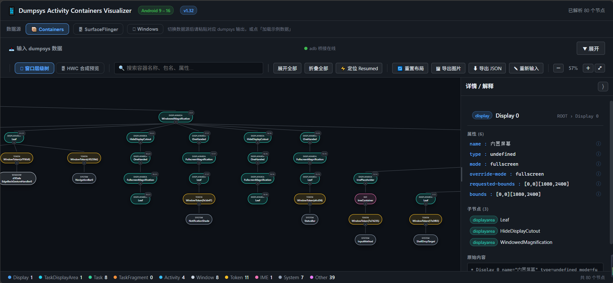
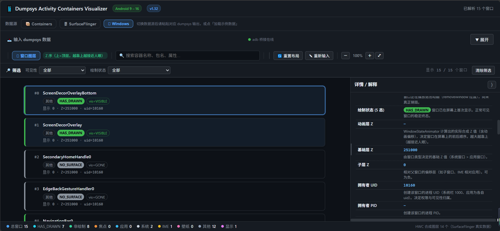
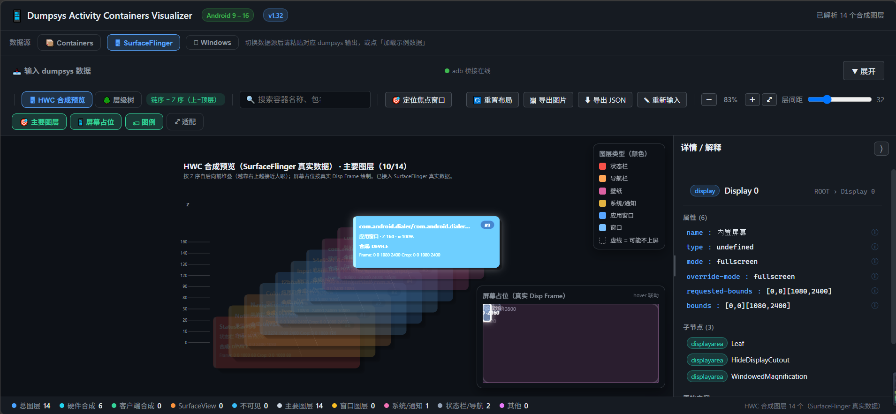

# Dumpsys Activity Containers Visualizer

> 一个**单文件、零依赖**的 Android 窗口层级可视化工具：把 `adb dumpsys` 的庞杂文本，变成可缩放、可搜索、可折叠的层级树与图层卡片。
> 支持 `dumpsys activity containers` / `dumpsys SurfaceFlinger` / `dumpsys window`，覆盖 **Android 9 – 16**。

[](LICENSE) [](#快速开始) [](#版本)

---

## 这是什么

在 Android 系统里排查窗口层级、合成合层（HWC）、`mDrawState` 绘制状态时，原生的 `dumpsys` 输出动辄上千行纯文本，人眼几乎无法快速理清「谁在谁上面、谁挡住了谁」。

本工具把这些文本解析成结构化的可视化视图：

- **容器树**：`dumpsys activity containers` 的 WindowContainer 层级（DisplayContent → TaskDisplayArea → Task → ActivityRecord → WindowToken → WindowState …）。
- **HWC 合成预览**：`dumpsys SurfaceFlinger` 中真实合层（Hardware Composer）的图层清单与几何，标注焦点窗口。
- **SF 层级树**：Android 14+ 整合的 `Layer Hierarchy` 段，呈现 SurfaceFlinger 侧的完整层级。
- **窗口图层**：`dumpsys window` 的每个窗口卡片，按 Z 序排列，并标出 **5 种 `mDrawState`** 状态。

无需安装任何 npm 包、无需构建步骤——下载即用。

---

## 特性

- 🧩 **单文件 HTML**：`index.html` 内聚全部逻辑与样式，可直接双击打开（示例/手动粘贴模式）。
- 🔌 **零依赖桥接**：`adb-bridge.js` 仅用 Node.js 内置模块，不需要 `npm install`。
- 📦 **便携 Node 运行时**：`node/node.exe` 已随包提供，没有 Node.js 也能跑（跨设备干净复制即可用）。
- 🪟 **三端启动器**：`start-tool.bat`（Windows）/ `start-tool.sh`（macOS·Linux·Git Bash），双击即启动并自动打开浏览器。
- 🔍 **统一交互**：搜索、节点折叠、重置布局、导出图片，在 Containers / SurfaceFlinger / Window 各视图一致可用。
- 📱 **Android 9–16 全对齐**：A9/10/11 扁平格式、A12/13 分散旧格式、A14+ 树形 `Layer Hierarchy` 均已适配。
- 🧪 **内置样例数据**：未接设备也能先看效果，上手零门槛。

---

## 使用截图

| 容器树（Containers） | 窗口图层（Windows） |
| --- | --- |
|  |  |



- **容器树**：`dumpsys activity containers` 的 WindowContainer 层级，支持缩放、搜索、节点折叠与导出图片。
- **窗口图层**：`dumpsys window` 的每个窗口卡片，按 Z 序（降序）排列，标出焦点窗口与 5 种 `mDrawState`。
- **SF 层级树**：Android 14+ 整合的 `Layer Hierarchy` 完整层级（可开启「以容器形式展示」折叠窗口子 surface）。

---

## 目录结构

```text
dumpsys-activity-containers-visualizer/
├── index.html          # 主工具（单文件，零依赖）
├── adb-bridge.js       # adb 桥接服务（Node.js 内置模块，无需 npm install）
├── start-tool.bat      # Windows 启动器（双击运行）
├── start-tool.sh       # macOS / Linux / Git Bash 启动器
├── node/
│   └── node.exe        # 便携 Node.js 运行时（v22.x，约 84MB，已随包提供）
├── samples/            # 使用截图（README 展示用）
│   ├── window_containers.png
│   ├── SurfaceFlinger.png
│   └── windows.png
├── README.md
└── LICENSE
```

> `node/node.exe` 一并随仓库提供，目的是让工具**自包含、可干净地拷贝到任意设备直接运行**。它约 84MB，克隆仓库时会一并下载——若你已在本机装好 Node.js，可忽略该文件，启动器会自动优先使用系统 Node。

---

## 快速开始

### Windows

直接**双击 `start-tool.bat`**。它会：

1. 自动定位 Node.js（优先用同目录 `node/node.exe`，其次 PATH / 常见安装路径）；
2. 启动 adb 桥接服务（终端窗口保持打开 = 服务在线）；
3. 自动打开浏览器访问 `http://127.0.0.1:7788/`。

关闭该终端窗口（或 `Ctrl+C`）即停止服务。

### macOS / Linux / Git Bash

在终端执行：

```bash
bash start-tool.sh
```

行为同上：启动桥接 → 自动打开浏览器。未检测到 Node.js 时进入降级模式（直接打开 `index.html`，仅示例/手动粘贴可用）。

### 不需要设备也能看

直接双击 `index.html` 用浏览器打开，工具内置了代表性样例数据，可立即体验各视图与交互。

---

## 工作原理

工具运行在「浏览器 ↔ 本地桥接 ↔ adb」三层结构，没有云端、没有后台进程常驻：

```text
┌──────────────┐      HTTP (127.0.0.1:7788)      ┌──────────────┐      adb       ┌──────────┐
│  浏览器      │ ───────────────────────────────▶ │  adb-bridge  │ ───────────▶ │  设备    │
│  index.html  │ ◀─────────────────────────────── │  .js (Node)  │ ◀─────────── │ (Android)│
└──────────────┘    dumpsys 文本 / 设备列表        └──────────────┘  dumpsys 输出 └──────────┘
```

- 桥接服务只在本机 `127.0.0.1` 监听，**不上传任何数据**，纯本地解析。
- 服务**不会自动退出**：只有你主动关闭终端 / `Ctrl+C` / 关闭工具页面（发送停止信号）时停止。
- 点击工具内「从设备抓取」即向桥接请求 `adb devices` 与 `adb shell dumpsys ...`，取回文本后在前端解析渲染。

> 为什么需要桥接而不是直接在网页里跑 adb？浏览器出于安全限制无法直接调用 `adb`。桥接服务用 Node.js 在本机起一个轻量 HTTP 服务，作为浏览器与 adb 之间的安全代理。

---

## 支持范围

| 项目 | 说明 |
| --- | --- |
| Android 版本 | 9 / 10 / 11 / 12 / 13 / 14 / 15 / 16 |
| 数据源 | `dumpsys activity containers`、`dumpsys SurfaceFlinger`、`dumpsys window` |
| 视图 | 容器树、HWC 合成预览、SF 层级树（A14+）、窗口图层 |
| 解析格式 | A9–11 扁平 `Visible/HWC layers`；A12/13 分散旧格式（TimeStats → Offscreen Layers）；A14+ 树形 `Layer Hierarchy` |

---

## 各视图说明

### 1. 容器树（Containers）
解析 `dumpsys activity containers`，还原 WMS 的 WindowContainer 子树。从 `DisplayContent` 根节点逐级展开到 `WindowState`，每个节点标注类型、token、焦点状态。

### 2. HWC 合成预览（SurfaceFlinger）
解析 `dumpsys SurfaceFlinger` 的 **HWC layers** 真实合层表（这是合层权威清单），展示每个图层的几何、Z 序，并高亮当前焦点窗口。未接设备时由 containers 数据推导 HWC（仅供参考）。

### 3. SF 层级树（SurfaceFlinger Tree，Android 14+）
解析 Android 14 起整合的 `Layer Hierarchy` 树形段，呈现 SurfaceFlinger 侧的完整层级（与 containers 同源，但把每个窗口再向下拆出子 surface 并多出辅助层）。可开启「以容器形式展示」开关折叠窗口子 surface。

### 4. 窗口图层（Windows）
解析 `dumpsys window windows`，按 Z 序（降序）排列每个窗口卡片，标出焦点窗口 `★`，并展示 `mDrawState`、尺寸、属性等关键参数。

---

## mDrawState 五态

`WindowState.mDrawState` 描述窗口「绘制到可显示」的状态机，工具用 5 种颜色区分：

| 状态 | 值 | 含义 |
| --- | --- | --- |
| `NO_SURFACE` | 0 | 还没有 Surface，窗口尚未开始绘制 |
| `DRAW_PENDING` | 1 | 已请求绘制，但第一帧尚未完成 |
| `COMMIT_DRAW_PENDING` | 2 | 绘制已提交，等待合成确认 |
| `READY_TO_SHOW` | 3 | 已就绪，可以显示（等待动画/策略放行） |
| `HAS_DRAWN` | 4 | 已完成绘制并上屏，正常可见状态 |

> 排查「窗口黑屏 / 不显示」时，先看目标窗口是否停在 `DRAW_PENDING` / `COMMIT_DRAW_PENDING`——往往意味着绘制被阻塞或 Surface 未提交。

---

## 端口与桥接

- 默认端口 `7788`；若被占用会自动顺延到 `7789 … 7798`。
- 可用环境变量覆盖：`ADB_BRIDGE_PORT=9000 node adb-bridge.js`。
- 桥接生命周期完全由你控制：
  - **启动**：运行 `start-tool.bat` / `start-tool.sh`（或手动 `node adb-bridge.js`）。
  - **停止**：关闭启动器终端 / `Ctrl+C` / 在工具内关闭页面（发送停止信号）。
- 桥接**永不自动自杀**：没有心跳超时、没有闲置退出，开着就一直在线，直到你主动关。

---

## 常见问题（FAQ）

**Q：点击「从设备抓取」提示未检测到桥接 / adb 未连接？**
A：先运行 `start-tool.bat`（Windows）或 `start-tool.sh`（mac/linux）。若仍失败，确认：
- 设备已通过 USB 连接且 `adb devices` 能看到它；
- 启动器终端提示 `adb ready`；若提示 `adb not found`，请把 `adb` 加入 PATH 或安装 [Android Platform-Tools](https://developer.android.com/tools/releases/platform-tools)。

**Q：没有 Node.js 能跑吗？**
A：能。`node/node.exe` 已随包提供，启动器会自动用它。你也可以手动放到 `node/node.exe`，或安装系统 Node.js（启动器会优先检测同目录便携版，其次 PATH）。

**Q：桥接会在后台偷偷常驻吗？**
A：不会。桥接只在启动器终端开着时运行，关闭终端即停止，没有任何常驻进程或自启动。

**Q：数据会传到外部吗？**
A：不会。所有解析都在本机浏览器内完成，桥接仅在本机 `127.0.0.1` 与 adb 通信，不上传任何数据。

**Q：端口被占用 / 启动失败？**
A：换端口：`ADB_BRIDGE_PORT=9000 node adb-bridge.js`；或先结束占用 7788 的进程。

**Q：页面打不开 / 样式错乱？**
A：请用现代浏览器（Chrome / Edge / Firefox 新版本）打开 `index.html` 或 `http://127.0.0.1:7788/`。

---

## 本地开发

本工具无需构建。若想本地改动：

```bash
# 任选其一启动桥接
bash start-tool.sh
# 或
node adb-bridge.js

# 然后用浏览器打开 http://127.0.0.1:7788/
```

- `index.html`：所有前端逻辑（解析、渲染、交互）均在这一文件内，直接编辑刷新即可。
- `adb-bridge.js`：桥接服务本体（仅用 Node.js 内置 `http` / `child_process`，无需依赖）。
- 抓取命令可在 `adb-bridge.js` 的 `/dump` 处理中调整（`containers` / `surfaceflinger` / `window`）。

---

## 许可证

本项目以 [MIT License](LICENSE) 开源，可自由使用、修改、再分发。

---

## 版本

- **v1.32**（当前）：新增「dumpsys window」数据源与「窗口图层」视图，可视化 5 种 `mDrawState`；统一多视图交互；桥接改为纯手动控制（启动器 + 便携 Node）。
- 早期版本（`v1.0` / `v1.10`–`v1.12`）作为封版快照保留。

---

*用 `adb` + 浏览器，把晦涩的 dumpsys 变成一眼看懂的层级图。*
